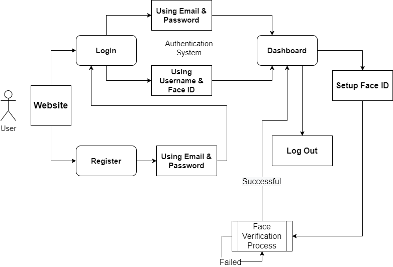

# Face Recognition System
## Main Theme : Face Recognition System
### Usecase : Device Security

This project is a submission project for Microsoft Engage 2022. Built using Flask Framework of Python

The project is build using `python` language. There are certain libraries that are needed to run this project on the local machine. All of those libraries are given in `requirements.txt` file.

## Setting the environment 
1. Clone the repository or download zip
2. Make sure you have `python` version `>=3.6` and `pip` installed on your device before doing anything.
3. It is suggested to create a virtual environment to try out this app. to create virtual environment follow [this](https://uoa-eresearch.github.io/eresearch-cookbook/recipe/2014/11/26/python-virtual-env/) tutorial.
4. Download and install libraries given in requirement.txt using command 
        
        pip install -r requirements.txt

5. If you face any problem regarding the installation of `dlib` library check whether you have `Visual Studio` with `Visual C++ Tools for Cmake` installed. If not then download it and then install `dlib` library.

    5.1 If you still unable to install dlib on your machine, try installing it using the following steps
    ```text
        Step 1: To Check Python Version Type in cmd python --version
        
        Step 2: For your version of python, change the link of dlib installation in `requirements.txt`

        > Python 3.7
        https://github.com/Murtaza-Saeed/dlib/raw/master/dlib-19.19.0-cp37-cp37m-win_amd64.whl  

        > Python 3.8
        https://github.com/Murtaza-Saeed/dlib/raw/master/dlib-19.19.0-cp38-cp38-win_amd64.whl  

        > Python 3.9
        https://github.com/Murtaza-Saeed/dlib/raw/master/dlib-19.22.1-cp39-cp39-win_amd64.whl  

        > Python 3.10
        https://github.com/Murtaza-Saeed/dlib/raw/master/dlib-19.22.99-cp310-cp310-win_amd64.whl  
    ```   
6.  After Installation of all the libraries. you can run the app using the `app.py` python file using the command
    ```python    
        python app.py
    ```
7. The app will run on port `5000`, open any browser and navigate to `localhost:5000`, you will able to view the app.

8. Make sure you have good internet connection and good lightning in the room where you are using the `face regonition app`.

9. Enjoy the App!

## Working of App


## Features of the App

1. You can login and signup with your account.
2. You can setup the Face Id for your account.
3. You can also login with your Face Id.

## Sample User Id and Password for Login

> You can directly create an dummy account on the web app because the app is built upon cloud database of firebase

Username : demoforengage

Email : demo@engage2022.com

Password : engage2022
